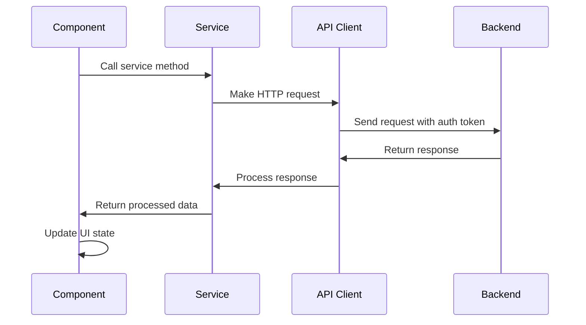
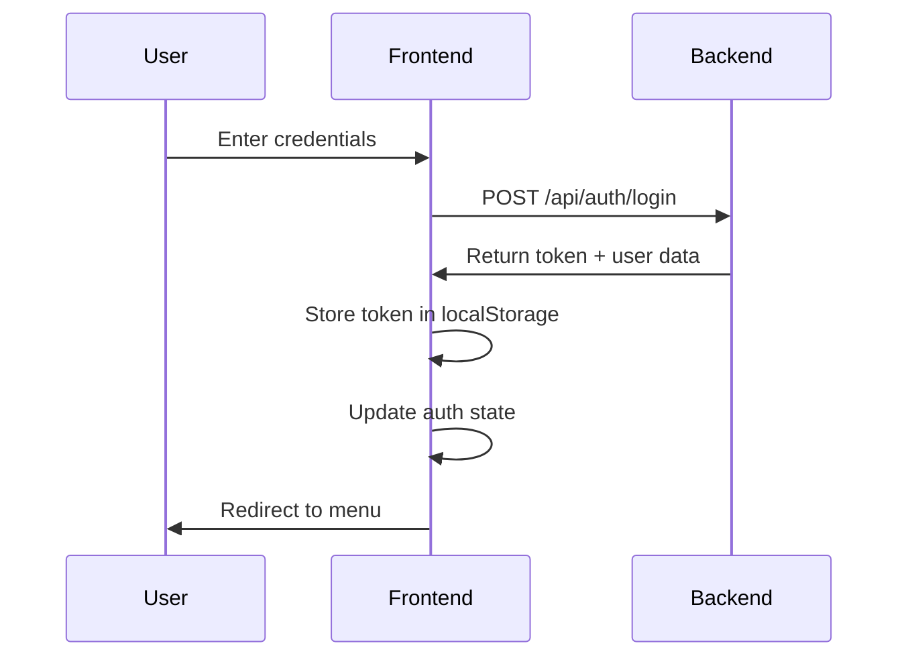
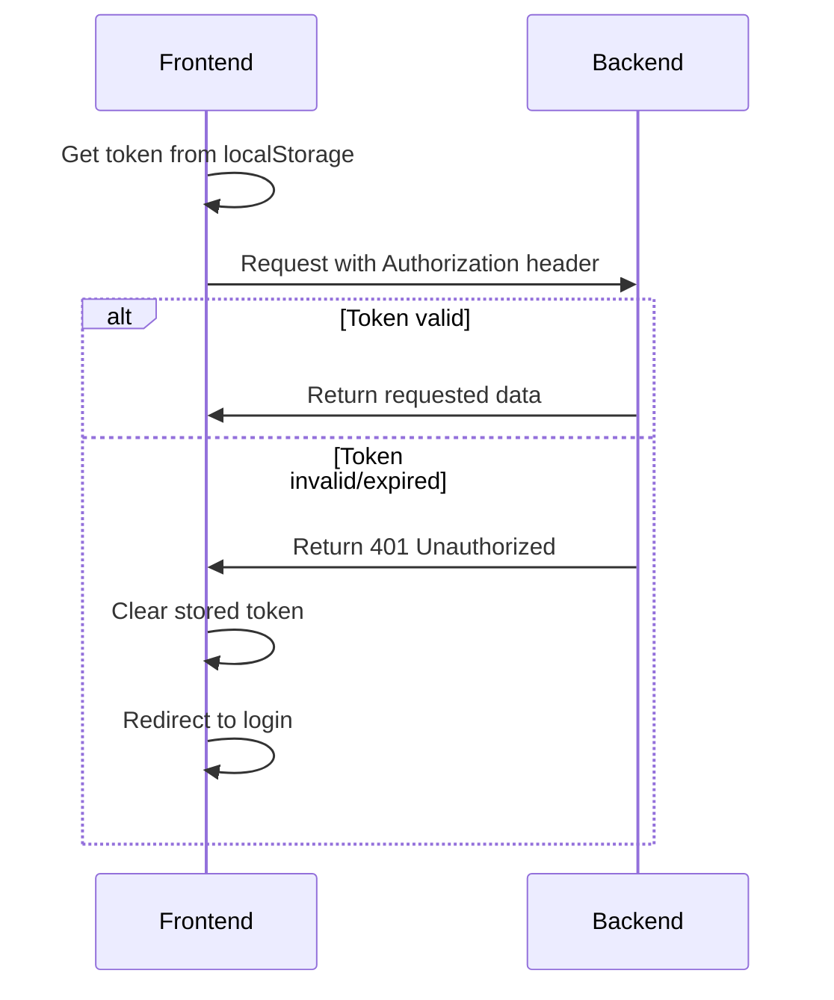

# API Integration Documentation

This document describes how the frontend communicates with the backend API.

## 🌐 API Architecture

The frontend uses a centralized API service layer for all backend communication:

```
src/services/
├── api.js            # Main API client and base configuration
├── authService.js    # Authentication-related API calls
├── gameService.js    # Game-related API calls
└── userService.js    # User profile and stats API calls
```

## ⚙️ API Configuration

### Base Configuration
**File**: `src/services/api.js`

```javascript
const API_BASE_URL = process.env.NODE_ENV === 'production' 
  ? 'https://your-backend-url.com' 
  : 'http://localhost:8000';

const apiClient = axios.create({
  baseURL: API_BASE_URL,
  timeout: 10000,
  headers: {
    'Content-Type': 'application/json',
  },
});
```

### Request Interceptors
```javascript
// Add authentication token to requests
apiClient.interceptors.request.use((config) => {
  const token = localStorage.getItem('accessToken');
  if (token) {
    config.headers.Authorization = `Bearer ${token}`;
  }
  return config;
});
```

### Response Interceptors
```javascript
// Handle authentication errors globally
apiClient.interceptors.response.use(
  (response) => response,
  (error) => {
    if (error.response?.status === 401) {
      // Clear token and redirect to login
      localStorage.removeItem('accessToken');
      window.location.href = '/';
    }
    return Promise.reject(error);
  }
);
```

## 🔐 Authentication Service

**File**: `src/services/authService.js`

### Login
```javascript
export const login = async (username, password) => {
  try {
    const response = await apiClient.post('/api/auth/login', {
      username,
      password
    });
    
    const { access_token, user } = response.data;
    
    // Store token and user data
    localStorage.setItem('accessToken', access_token);
    localStorage.setItem('user', JSON.stringify(user));
    
    return { success: true, user };
  } catch (error) {
    throw new Error(error.response?.data?.detail || 'Login failed');
  }
};
```

### Registration
```javascript
export const register = async (username, email, password) => {
  try {
    const response = await apiClient.post('/api/auth/register', {
      username,
      email,
      password
    });
    
    const { access_token, user } = response.data;
    
    // Auto-login after registration
    localStorage.setItem('accessToken', access_token);
    localStorage.setItem('user', JSON.stringify(user));
    
    return { success: true, user };
  } catch (error) {
    throw new Error(error.response?.data?.detail || 'Registration failed');
  }
};
```

### Logout
```javascript
export const logout = () => {
  localStorage.removeItem('accessToken');
  localStorage.removeItem('user');
  window.location.href = '/';
};
```

### Google OAuth
```javascript
export const loginWithGoogle = (code) => {
  return apiClient.post('/api/auth/google', { code });
};
```

## 🎮 Game Service

**File**: `src/services/gameService.js`

### Start New Game
```javascript
export const startGame = async (difficulty = 'medium') => {
  try {
    const response = await apiClient.post('/api/game/start', {
      difficulty
    });
    return response.data;
  } catch (error) {
    throw new Error(error.response?.data?.detail || 'Failed to start game');
  }
};
```

### Submit Guess
```javascript
export const submitGuess = async (gameId, guess) => {
  try {
    const response = await apiClient.post(`/api/game/${gameId}/guess`, {
      guess: guess.toLowerCase()
    });
    return response.data;
  } catch (error) {
    throw new Error(error.response?.data?.detail || 'Invalid guess');
  }
};
```

### Get Game Status
```javascript
export const getGameStatus = async (gameId) => {
  try {
    const response = await apiClient.get(`/api/game/${gameId}`);
    return response.data;
  } catch (error) {
    throw new Error('Failed to get game status');
  }
};
```

### Validate Word
```javascript
export const validateWord = async (word) => {
  try {
    const response = await apiClient.post('/api/game/validate', {
      word: word.toLowerCase()
    });
    return response.data.is_valid;
  } catch (error) {
    return false;
  }
};
```

## 👤 User Service

**File**: `src/services/userService.js`

### Get User Profile
```javascript
export const getUserProfile = async () => {
  try {
    const response = await apiClient.get('/api/user/profile');
    return response.data;
  } catch (error) {
    throw new Error('Failed to get user profile');
  }
};
```

### Update Profile
```javascript
export const updateProfile = async (profileData) => {
  try {
    const response = await apiClient.put('/api/user/profile', profileData);
    return response.data;
  } catch (error) {
    throw new Error(error.response?.data?.detail || 'Failed to update profile');
  }
};
```

### Get Statistics
```javascript
export const getStatistics = async () => {
  try {
    const response = await apiClient.get('/api/user/stats');
    return response.data;
  } catch (error) {
    throw new Error('Failed to get statistics');
  }
};
```

### Get Game History
```javascript
export const getGameHistory = async (page = 1, limit = 20) => {
  try {
    const response = await apiClient.get('/api/user/history', {
      params: { page, limit }
    });
    return response.data;
  } catch (error) {
    throw new Error('Failed to get game history');
  }
};
```

## 🔄 Error Handling

### Global Error Handler
```javascript
export const handleApiError = (error) => {
  if (error.response) {
    // Server responded with error status
    const message = error.response.data?.detail || 'An error occurred';
    return { error: message, status: error.response.status };
  } else if (error.request) {
    // Network error
    return { error: 'Network error. Please check your connection.', status: null };
  } else {
    // Other error
    return { error: error.message || 'An unexpected error occurred', status: null };
  }
};
```

### Usage in Components
```javascript
const MyComponent = () => {
  const [error, setError] = useState(null);
  const [loading, setLoading] = useState(false);

  const handleApiCall = async () => {
    try {
      setLoading(true);
      setError(null);
      const result = await someApiCall();
      // Handle success
    } catch (err) {
      const { error } = handleApiError(err);
      setError(error);
    } finally {
      setLoading(false);
    }
  };

  return (
    <div>
      {error && <ErrorMessage message={error} />}
      {loading && <LoadingSpinner />}
      {/* Component content */}
    </div>
  );
};
```

## 📊 Request/Response Flow

### Typical API Call Flow


## 🔒 Authentication Flow

### Login Flow


### Protected Request Flow


## 🚀 Performance Optimization

### Request Caching
```javascript
// Simple in-memory cache for static data
const cache = new Map();

export const getCachedData = async (key, fetchFn, ttl = 300000) => {
  const cached = cache.get(key);
  
  if (cached && Date.now() - cached.timestamp < ttl) {
    return cached.data;
  }
  
  const data = await fetchFn();
  cache.set(key, { data, timestamp: Date.now() });
  return data;
};
```

### Request Debouncing
```javascript
// Debounce API calls for search/validation
export const debouncedValidateWord = debounce(validateWord, 300);
```

### Loading States
```javascript
// Consistent loading state management
export const useApiCall = (apiFunction) => {
  const [data, setData] = useState(null);
  const [loading, setLoading] = useState(false);
  const [error, setError] = useState(null);

  const execute = async (...args) => {
    try {
      setLoading(true);
      setError(null);
      const result = await apiFunction(...args);
      setData(result);
      return result;
    } catch (err) {
      const { error } = handleApiError(err);
      setError(error);
      throw err;
    } finally {
      setLoading(false);
    }
  };

  return { data, loading, error, execute };
};
```
