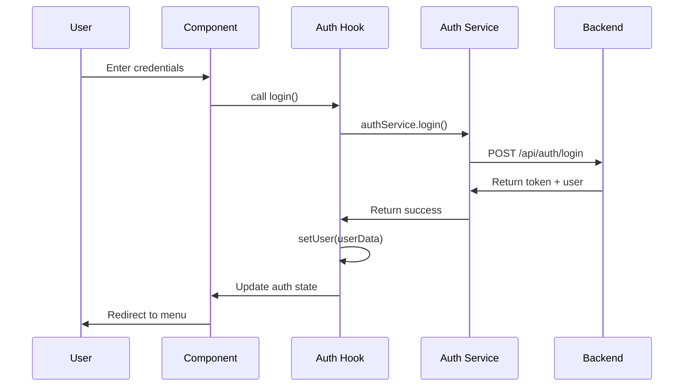
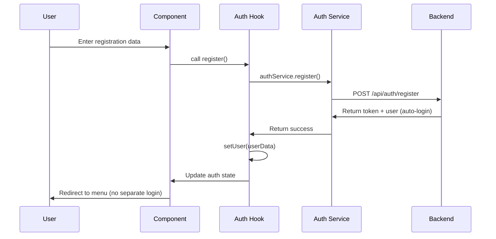

# Authentication Documentation

This document describes the authentication system implementation in the frontend.

## 🔐 Authentication Architecture

The authentication system uses JWT tokens with localStorage persistence and React Context for state management.

```
src/
├── hooks/
│   └── useAuth.js         # Authentication hook
├── utils/
│   └── authUtils.js       # Authentication utilities
├── services/
│   └── authService.js     # API authentication calls
└── components/
    └── auth/
        └── AuthModal.jsx  # Login/Register modal
```

## 🎣 useAuth Hook

**File**: `src/hooks/useAuth.js`
**Purpose**: Central authentication state management

### Hook Implementation
```javascript
import { createContext, useContext, useState, useEffect } from 'react';
import { authService } from '../services/authService';

const AuthContext = createContext();

export const AuthProvider = ({ children }) => {
  const [user, setUser] = useState(null);
  const [loading, setLoading] = useState(true);

  useEffect(() => {
    // Check for existing authentication on app load
    const initAuth = async () => {
      try {
        const token = localStorage.getItem('accessToken');
        const userData = localStorage.getItem('user');
        
        if (token && userData) {
          setUser(JSON.parse(userData));
        }
      } catch (error) {
        console.error('Auth initialization error:', error);
        // Clear invalid data
        localStorage.removeItem('accessToken');
        localStorage.removeItem('user');
      } finally {
        setLoading(false);
      }
    };

    initAuth();
  }, []);

  const login = async (username, password) => {
    try {
      const result = await authService.login(username, password);
      setUser(result.user);
      return result;
    } catch (error) {
      throw error;
    }
  };

  const register = async (username, email, password) => {
    try {
      const result = await authService.register(username, email, password);
      setUser(result.user);
      return result;
    } catch (error) {
      throw error;
    }
  };

  const logout = () => {
    authService.logout();
    setUser(null);
  };

  const value = {
    user,
    loading,
    login,
    register,
    logout,
    isAuthenticated: !!user
  };

  return (
    <AuthContext.Provider value={value}>
      {children}
    </AuthContext.Provider>
  );
};

export const useAuth = () => {
  const context = useContext(AuthContext);
  if (!context) {
    throw new Error('useAuth must be used within an AuthProvider');
  }
  return context;
};
```

### Usage in Components
```javascript
const MyComponent = () => {
  const { user, login, logout, isAuthenticated, loading } = useAuth();

  if (loading) return <LoadingSpinner />;

  return (
    <div>
      {isAuthenticated ? (
        <div>
          <p>Welcome, {user.username}!</p>
          <button onClick={logout}>Logout</button>
        </div>
      ) : (
        <LoginForm onLogin={login} />
      )}
    </div>
  );
};
```

## 🛠️ Authentication Utilities

**File**: `src/utils/authUtils.js`

### Token Management
```javascript
export const getToken = () => {
  return localStorage.getItem('accessToken');
};

export const setToken = (token) => {
  localStorage.setItem('accessToken', token);
};

export const removeToken = () => {
  localStorage.removeItem('accessToken');
};

export const isTokenExpired = (token) => {
  if (!token) return true;
  
  try {
    const payload = JSON.parse(atob(token.split('.')[1]));
    return payload.exp * 1000 < Date.now();
  } catch {
    return true;
  }
};
```

### User Data Management
```javascript
export const getUserData = () => {
  try {
    const userData = localStorage.getItem('user');
    return userData ? JSON.parse(userData) : null;
  } catch {
    return null;
  }
};

export const setUserData = (user) => {
  localStorage.setItem('user', JSON.stringify(user));
};

export const removeUserData = () => {
  localStorage.removeItem('user');
};
```

### Authentication Validation
```javascript
export const isAuthenticated = () => {
  const token = getToken();
  const user = getUserData();
  
  return !!(token && user && !isTokenExpired(token));
};

export const requireAuth = () => {
  if (!isAuthenticated()) {
    throw new Error('Authentication required');
  }
};
```

## 🔒 Protected Routes

### Route Protection Component
```javascript
import { Navigate } from 'react-router-dom';
import { useAuth } from '../hooks/useAuth';

const ProtectedRoute = ({ children }) => {
  const { isAuthenticated, loading } = useAuth();

  if (loading) {
    return <LoadingSpinner />;
  }

  if (!isAuthenticated) {
    return <Navigate to="/" replace />;
  }

  return children;
};

export default ProtectedRoute;
```

### Usage in Router
```javascript
import { BrowserRouter, Routes, Route } from 'react-router-dom';

const App = () => {
  return (
    <AuthProvider>
      <BrowserRouter>
        <Routes>
          <Route path="/" element={<LandingPage />} />
          <Route 
            path="/menu" 
            element={
              <ProtectedRoute>
                <MenuScreen />
              </ProtectedRoute>
            } 
          />
          <Route 
            path="/practice" 
            element={
              <ProtectedRoute>
                <PracticeGame />
              </ProtectedRoute>
            } 
          />
        </Routes>
      </BrowserRouter>
    </AuthProvider>
  );
};
```

## 📝 AuthModal Component

**File**: `src/components/auth/AuthModal.jsx`

### Component Structure
```javascript
const AuthModal = ({ isOpen, onClose, initialMode = 'login' }) => {
  const [mode, setMode] = useState(initialMode);
  const [formData, setFormData] = useState({
    username: '',
    email: '',
    password: ''
  });
  const [errors, setErrors] = useState({});
  const [loading, setLoading] = useState(false);
  
  const { login, register } = useAuth();

  const handleSubmit = async (e) => {
    e.preventDefault();
    setLoading(true);
    setErrors({});

    try {
      if (mode === 'login') {
        await login(formData.username, formData.password);
      } else {
        await register(formData.username, formData.email, formData.password);
      }
      
      onClose();
      // User will be redirected by auth state change
    } catch (error) {
      setErrors({ general: error.message });
    } finally {
      setLoading(false);
    }
  };

  // Component JSX...
};
```

### Form Validation
```javascript
const validateForm = () => {
  const newErrors = {};

  if (!formData.username.trim()) {
    newErrors.username = 'Username is required';
  } else if (formData.username.length < 3) {
    newErrors.username = 'Username must be at least 3 characters';
  }

  if (mode === 'register' && !formData.email.trim()) {
    newErrors.email = 'Email is required';
  } else if (mode === 'register' && !/\S+@\S+\.\S+/.test(formData.email)) {
    newErrors.email = 'Please enter a valid email';
  }

  if (!formData.password) {
    newErrors.password = 'Password is required';
  } else if (formData.password.length < 6) {
    newErrors.password = 'Password must be at least 6 characters';
  }

  setErrors(newErrors);
  return Object.keys(newErrors).length === 0;
};
```

## 🌐 Google OAuth Integration

### OAuth Flow
```javascript
// Initiate Google OAuth
export const initiateGoogleAuth = () => {
  const clientId = process.env.REACT_APP_GOOGLE_CLIENT_ID;
  const redirectUri = `${window.location.origin}/auth/google/callback`;
  const scope = 'openid email profile';
  
  const authUrl = `https://accounts.google.com/o/oauth2/v2/auth?` +
    `client_id=${clientId}&` +
    `redirect_uri=${encodeURIComponent(redirectUri)}&` +
    `response_type=code&` +
    `scope=${encodeURIComponent(scope)}`;
  
  window.location.href = authUrl;
};

// Handle OAuth callback
export const handleGoogleCallback = async (code) => {
  try {
    const response = await authService.loginWithGoogle(code);
    const { access_token, user } = response.data;
    
    setToken(access_token);
    setUserData(user);
    
    return { success: true, user };
  } catch (error) {
    throw new Error('Google authentication failed');
  }
};
```

### Google Callback Component
```javascript
// src/pages/GoogleCallback.jsx
const GoogleCallback = () => {
  const { login } = useAuth();
  const navigate = useNavigate();

  useEffect(() => {
    const handleCallback = async () => {
      try {
        const urlParams = new URLSearchParams(window.location.search);
        const code = urlParams.get('code');
        
        if (code) {
          await handleGoogleCallback(code);
          navigate('/menu');
        } else {
          throw new Error('No authorization code received');
        }
      } catch (error) {
        console.error('OAuth callback error:', error);
        navigate('/?error=oauth_failed');
      }
    };

    handleCallback();
  }, [navigate]);

  return <LoadingSpinner message="Completing authentication..." />;
};
```

## 🔄 Authentication Flow Diagrams

### Login Flow


### Registration with Auto-Login Flow


## 🛡️ Security Best Practices

### Token Security
- Store JWT tokens in localStorage (consider httpOnly cookies for production)
- Implement token refresh mechanism for long-lived sessions
- Clear tokens on logout and authentication errors
- Validate token expiration before API calls

### Form Security
- Implement client-side validation (not for security, for UX)
- Use HTTPS in production
- Implement rate limiting on login attempts
- Consider implementing CAPTCHA for repeated failures

### Error Handling
- Don't expose sensitive information in error messages
- Log authentication attempts for monitoring
- Implement graceful degradation for network failures

```javascript
// Secure error handling
const handleAuthError = (error) => {
  // Log detailed error for debugging
  console.error('Auth error:', error);
  
  // Return user-friendly message
  if (error.response?.status === 401) {
    return 'Invalid username or password';
  } else if (error.response?.status === 429) {
    return 'Too many login attempts. Please try again later';
  } else {
    return 'Authentication failed. Please try again';
  }
};
```
