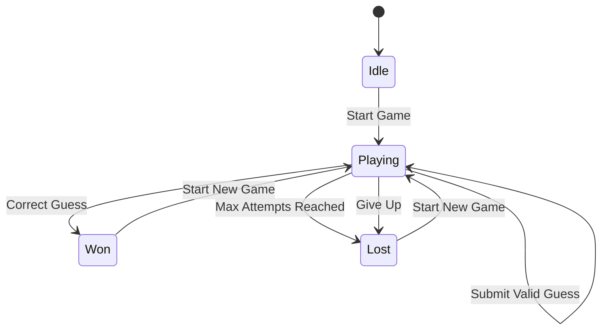

# Game Logic Documentation

This document describes the frontend game mechanics and logic for the Wordle game.

## 🎮 Game Architecture

The game logic is distributed across several modules:

```
src/
├── hooks/
│   ├── useGame.js         # Main game state management
│   ├── useKeyboard.js     # Keyboard input handling
│   └── useWordValidation.js # Word validation logic
├── utils/
│   ├── gameUtils.js       # Game utility functions
│   └── wordUtils.js       # Word processing utilities
└── services/
    └── gameService.js     # API communication for game
```

## 🎯 useGame Hook

**File**: `src/hooks/useGame.js`
**Purpose**: Central game state management and logic

### Hook Implementation
```javascript
import { useState, useCallback, useEffect } from 'react';
import { gameService } from '../services/gameService';
import { validateGuess, evaluateGuess } from '../utils/gameUtils';

export const useGame = (difficulty = 'medium') => {
  const [gameState, setGameState] = useState({
    gameId: null,
    targetWord: '',
    guesses: [],
    currentGuess: '',
    gameStatus: 'idle', // 'idle', 'playing', 'won', 'lost'
    attempts: 0,
    maxAttempts: 6,
    difficulty,
    startTime: null,
    endTime: null
  });

  const [keyboardState, setKeyboardState] = useState({
    correct: new Set(),
    present: new Set(),
    absent: new Set()
  });

  // Start new game
  const startGame = useCallback(async () => {
    try {
      const gameData = await gameService.startGame(difficulty);
      
      setGameState({
        gameId: gameData.game_id,
        targetWord: '', // Keep secret from frontend
        guesses: [],
        currentGuess: '',
        gameStatus: 'playing',
        attempts: 0,
        maxAttempts: 6,
        difficulty,
        startTime: Date.now(),
        endTime: null
      });

      // Reset keyboard state
      setKeyboardState({
        correct: new Set(),
        present: new Set(),
        absent: new Set()
      });

      return gameData;
    } catch (error) {
      throw new Error('Failed to start game');
    }
  }, [difficulty]);

  // Submit guess
  const submitGuess = useCallback(async () => {
    if (!gameState.gameId || gameState.currentGuess.length !== 5) {
      return;
    }

    try {
      const result = await gameService.submitGuess(
        gameState.gameId, 
        gameState.currentGuess
      );

      const newGuess = {
        word: gameState.currentGuess,
        evaluation: result.evaluation,
        attempt: gameState.attempts + 1
      };

      // Update keyboard state
      updateKeyboardState(gameState.currentGuess, result.evaluation);

      // Update game state
      setGameState(prev => ({
        ...prev,
        guesses: [...prev.guesses, newGuess],
        currentGuess: '',
        attempts: prev.attempts + 1,
        gameStatus: result.game_status,
        endTime: result.game_status !== 'playing' ? Date.now() : null
      }));

      return result;
    } catch (error) {
      throw new Error(error.message || 'Invalid guess');
    }
  }, [gameState.gameId, gameState.currentGuess, gameState.attempts]);

  // Update current guess
  const updateCurrentGuess = useCallback((guess) => {
    if (gameState.gameStatus !== 'playing') return;
    
    setGameState(prev => ({
      ...prev,
      currentGuess: guess.toUpperCase().slice(0, 5)
    }));
  }, [gameState.gameStatus]);

  // Delete last letter
  const deleteLetter = useCallback(() => {
    if (gameState.gameStatus !== 'playing') return;
    
    setGameState(prev => ({
      ...prev,
      currentGuess: prev.currentGuess.slice(0, -1)
    }));
  }, [gameState.gameStatus]);

  // Add letter
  const addLetter = useCallback((letter) => {
    if (gameState.gameStatus !== 'playing' || gameState.currentGuess.length >= 5) {
      return;
    }
    
    setGameState(prev => ({
      ...prev,
      currentGuess: prev.currentGuess + letter.toUpperCase()
    }));
  }, [gameState.gameStatus, gameState.currentGuess.length]);

  // Update keyboard state based on guess evaluation
  const updateKeyboardState = (word, evaluation) => {
    setKeyboardState(prev => {
      const newState = { ...prev };
      
      for (let i = 0; i < word.length; i++) {
        const letter = word[i];
        const result = evaluation[i];
        
        if (result === 'correct') {
          newState.correct.add(letter);
          newState.present.delete(letter);
        } else if (result === 'present' && !newState.correct.has(letter)) {
          newState.present.add(letter);
        } else if (result === 'absent') {
          newState.absent.add(letter);
        }
      }
      
      return newState;
    });
  };

  // Calculate game statistics
  const getGameStats = useCallback(() => {
    if (!gameState.startTime) return null;
    
    const duration = gameState.endTime 
      ? gameState.endTime - gameState.startTime 
      : Date.now() - gameState.startTime;
      
    return {
      attempts: gameState.attempts,
      duration: Math.floor(duration / 1000), // seconds
      status: gameState.gameStatus,
      difficulty: gameState.difficulty,
      guesses: gameState.guesses
    };
  }, [gameState]);

  return {
    gameState,
    keyboardState,
    startGame,
    submitGuess,
    updateCurrentGuess,
    deleteLetter,
    addLetter,
    getGameStats
  };
};
```

## ⌨️ useKeyboard Hook

**File**: `src/hooks/useKeyboard.js`
**Purpose**: Handle keyboard input and virtual keyboard interactions

```javascript
import { useEffect, useCallback } from 'react';

export const useKeyboard = ({ onKeyPress, onDelete, onEnter, disabled = false }) => {
  const handleKeyPress = useCallback((event) => {
    if (disabled) return;
    
    const key = event.key.toUpperCase();
    
    if (key === 'ENTER') {
      onEnter?.();
    } else if (key === 'BACKSPACE') {
      onDelete?.();
    } else if (/^[A-Z]$/.test(key)) {
      onKeyPress?.(key);
    }
  }, [onKeyPress, onDelete, onEnter, disabled]);

  useEffect(() => {
    document.addEventListener('keydown', handleKeyPress);
    return () => document.removeEventListener('keydown', handleKeyPress);
  }, [handleKeyPress]);

  // Virtual keyboard handler
  const handleVirtualKey = useCallback((key) => {
    if (disabled) return;
    
    if (key === 'ENTER') {
      onEnter?.();
    } else if (key === 'DELETE') {
      onDelete?.();
    } else {
      onKeyPress?.(key);
    }
  }, [onKeyPress, onDelete, onEnter, disabled]);

  return { handleVirtualKey };
};
```

## 🔤 useWordValidation Hook

**File**: `src/hooks/useWordValidation.js`
**Purpose**: Real-time word validation and feedback

```javascript
import { useState, useCallback } from 'react';
import { gameService } from '../services/gameService';
import { debounce } from '../utils/gameUtils';

export const useWordValidation = () => {
  const [validationState, setValidationState] = useState({
    isValid: null,
    isChecking: false,
    message: ''
  });

  const validateWord = useCallback(
    debounce(async (word) => {
      if (word.length !== 5) {
        setValidationState({
          isValid: null,
          isChecking: false,
          message: ''
        });
        return;
      }

      setValidationState(prev => ({ ...prev, isChecking: true }));

      try {
        const isValid = await gameService.validateWord(word);
        setValidationState({
          isValid,
          isChecking: false,
          message: isValid ? 'Valid word' : 'Not a valid word'
        });
      } catch (error) {
        setValidationState({
          isValid: false,
          isChecking: false,
          message: 'Unable to validate word'
        });
      }
    }, 500),
    []
  );

  const clearValidation = useCallback(() => {
    setValidationState({
      isValid: null,
      isChecking: false,
      message: ''
    });
  }, []);

  return {
    validationState,
    validateWord,
    clearValidation
  };
};
```

## 🛠️ Game Utilities

**File**: `src/utils/gameUtils.js`

### Guess Evaluation
```javascript
export const evaluateGuess = (guess, target) => {
  const result = new Array(5).fill('absent');
  const targetLetters = target.split('');
  const guessLetters = guess.split('');
  
  // First pass: mark correct letters
  for (let i = 0; i < 5; i++) {
    if (guessLetters[i] === targetLetters[i]) {
      result[i] = 'correct';
      targetLetters[i] = null; // Mark as used
      guessLetters[i] = null;  // Mark as processed
    }
  }
  
  // Second pass: mark present letters
  for (let i = 0; i < 5; i++) {
    if (guessLetters[i] !== null) {
      const targetIndex = targetLetters.indexOf(guessLetters[i]);
      if (targetIndex !== -1) {
        result[i] = 'present';
        targetLetters[targetIndex] = null; // Mark as used
      }
    }
  }
  
  return result;
};
```

### Game Validation
```javascript
export const validateGuess = (guess) => {
  const errors = [];
  
  if (!guess || guess.trim().length === 0) {
    errors.push('Please enter a word');
  } else if (guess.length !== 5) {
    errors.push('Word must be exactly 5 letters');
  } else if (!/^[A-Za-z]+$/.test(guess)) {
    errors.push('Word must contain only letters');
  }
  
  return {
    isValid: errors.length === 0,
    errors
  };
};
```

### Utility Functions
```javascript
export const debounce = (func, wait) => {
  let timeout;
  return function executedFunction(...args) {
    const later = () => {
      clearTimeout(timeout);
      func(...args);
    };
    clearTimeout(timeout);
    timeout = setTimeout(later, wait);
  };
};

export const formatTime = (seconds) => {
  const minutes = Math.floor(seconds / 60);
  const remainingSeconds = seconds % 60;
  return `${minutes}:${remainingSeconds.toString().padStart(2, '0')}`;
};

export const calculateScore = (attempts, timeSeconds, difficulty) => {
  const baseScore = 1000;
  const attemptPenalty = (attempts - 1) * 100;
  const timePenalty = Math.floor(timeSeconds / 10);
  const difficultyMultiplier = {
    easy: 0.8,
    medium: 1.0,
    hard: 1.3
  };
  
  const score = Math.max(0, 
    (baseScore - attemptPenalty - timePenalty) * difficultyMultiplier[difficulty]
  );
  
  return Math.round(score);
};
```

## 🎲 Game States and Transitions

### State Machine
```javascript
const gameStateMachine = {
  idle: {
    START_GAME: 'playing'
  },
  playing: {
    SUBMIT_GUESS: (attempts, maxAttempts, isCorrect) => {
      if (isCorrect) return 'won';
      if (attempts >= maxAttempts) return 'lost';
      return 'playing';
    },
    GIVE_UP: 'lost'
  },
  won: {
    START_NEW_GAME: 'playing'
  },
  lost: {
    START_NEW_GAME: 'playing'
  }
};

export const getNextGameState = (currentState, action, context = {}) => {
  const transitions = gameStateMachine[currentState];
  if (!transitions) return currentState;
  
  const transition = transitions[action];
  if (typeof transition === 'function') {
    return transition(context.attempts, context.maxAttempts, context.isCorrect);
  }
  
  return transition || currentState;
};
```

## 🎯 Game Flow Diagram



## 🎮 Multiplayer Game Logic

### Real-time State Synchronization
```javascript
export const useMultiplayerGame = (roomId) => {
  const [gameState, setGameState] = useState(null);
  const [opponents, setOpponents] = useState([]);
  const [socket, setSocket] = useState(null);

  useEffect(() => {
    const ws = new WebSocket(`ws://localhost:8000/ws/multiplayer/${roomId}`);
    
    ws.onopen = () => {
      console.log('Connected to multiplayer game');
    };
    
    ws.onmessage = (event) => {
      const data = JSON.parse(event.data);
      
      switch (data.type) {
        case 'GAME_STATE':
          setGameState(data.gameState);
          break;
        case 'OPPONENT_UPDATE':
          setOpponents(data.opponents);
          break;
        case 'GAME_END':
          handleGameEnd(data.result);
          break;
      }
    };
    
    setSocket(ws);
    
    return () => ws.close();
  }, [roomId]);

  const submitMultiplayerGuess = useCallback((guess) => {
    if (socket && socket.readyState === WebSocket.OPEN) {
      socket.send(JSON.stringify({
        type: 'SUBMIT_GUESS',
        guess,
        timestamp: Date.now()
      }));
    }
  }, [socket]);

  return {
    gameState,
    opponents,
    submitGuess: submitMultiplayerGuess
  };
};
```

## 📊 Performance Optimization

### Memoization
```javascript
import { useMemo } from 'react';

// Memoize expensive calculations
const GameBoard = ({ guesses, currentGuess }) => {
  const boardData = useMemo(() => {
    return generateBoardData(guesses, currentGuess);
  }, [guesses, currentGuess]);

  const keyboardState = useMemo(() => {
    return calculateKeyboardState(guesses);
  }, [guesses]);

  return (
    <div>
      <Board data={boardData} />
      <Keyboard state={keyboardState} />
    </div>
  );
};
```

### Debounced API Calls
```javascript
// Debounce word validation to avoid excessive API calls
const debouncedValidation = useMemo(
  () => debounce(validateWord, 300),
  []
);

useEffect(() => {
  if (currentGuess.length === 5) {
    debouncedValidation(currentGuess);
  }
}, [currentGuess, debouncedValidation]);
```

## 🎨 Visual Feedback

### Letter Animation States
```javascript
export const getLetterClassName = (letter, evaluation, position) => {
  const baseClass = 'game-letter';
  const stateClass = evaluation ? `letter-${evaluation}` : 'letter-empty';
  const animationClass = evaluation ? 'letter-flip' : '';
  const delayClass = `animation-delay-${position}`;
  
  return `${baseClass} ${stateClass} ${animationClass} ${delayClass}`;
};
```

### Keyboard Visual Updates
```javascript
export const getKeyClassName = (letter, keyboardState) => {
  const baseClass = 'keyboard-key';
  
  if (keyboardState.correct.has(letter)) {
    return `${baseClass} key-correct`;
  } else if (keyboardState.present.has(letter)) {
    return `${baseClass} key-present`;
  } else if (keyboardState.absent.has(letter)) {
    return `${baseClass} key-absent`;
  }
  
  return baseClass;
};
```
