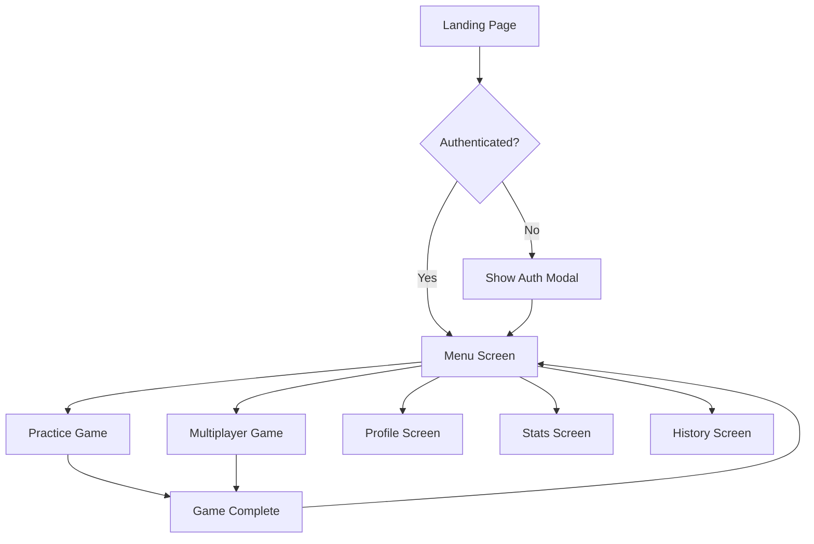

# Pages Documentation

This document describes the main pages/screens in the Wordle game frontend.

## 📄 Page Architecture

Pages represent complete application screens and are organized by functionality:

```
src/pages/
├── LandingPage.jsx        # Welcome/home page
├── MenuScreen.jsx         # Main game menu
├── PracticeGame.jsx       # Single-player practice mode
├── MultiplayerGame.jsx    # Multiplayer game mode
├── ProfileScreen.jsx      # User profile and settings
├── HistoryScreen.jsx      # Game history
├── StatsScreen.jsx        # Detailed statistics
├── ErrorPage.jsx          # Error handling page
└── GoogleCallback.jsx     # OAuth callback handler
```

## 🏠 Landing Page

**File**: `src/pages/LandingPage.jsx`
**Route**: `/`
**Purpose**: Welcome screen and entry point for new users

### Features
- Welcome message and game description
- Login/Register buttons
- Game preview or demo
- Responsive design for mobile/desktop

### State Management
- Authentication status checking
- Redirect logged-in users to menu

### Usage
```jsx
// Automatically redirects authenticated users
// Shows welcome content for guests
```

## 🎯 Menu Screen

**File**: `src/pages/MenuScreen.jsx`
**Route**: `/menu`
**Purpose**: Main navigation hub for authenticated users

### Features
- Game mode selection (Practice, Multiplayer)
- Quick access to profile and statistics
- Recent game summary
- User greeting with username

### Components Used
- Navigation buttons
- User stats summary
- Quick actions panel

## 🎮 Game Pages

### Practice Game
**File**: `src/pages/PracticeGame.jsx`
**Route**: `/practice`
**Purpose**: Single-player Wordle game

#### Features
- Classic Wordle gameplay
- Difficulty selection (Easy, Medium, Hard)
- Real-time word validation
- Statistics tracking
- Game completion handling

#### State Management
```jsx
const [gameState, setGameState] = useState({
  word: '',
  guesses: [],
  currentGuess: '',
  gameStatus: 'playing', // 'playing', 'won', 'lost'
  attempts: 0
});
```

#### Game Flow
1. Load random word from API
2. Accept user input (6 letters max)
3. Validate guess against word list
4. Provide visual feedback (green/yellow/gray)
5. Track attempts and update statistics
6. Handle win/loss conditions

### Multiplayer Game
**File**: `src/pages/MultiplayerGame.jsx`
**Route**: `/multiplayer`
**Purpose**: Real-time multiplayer Wordle

#### Features
- Room creation and joining
- Real-time opponent updates
- Synchronized game state
- Winner determination
- Lobby system

#### WebSocket Integration
```jsx
// Real-time game updates
useEffect(() => {
  const socket = new WebSocket(`ws://localhost:8000/ws/game/${roomId}`);
  
  socket.onmessage = (event) => {
    const data = JSON.parse(event.data);
    updateGameState(data);
  };
  
  return () => socket.close();
}, [roomId]);
```

## 👤 User Pages

### Profile Screen
**File**: `src/pages/ProfileScreen.jsx`
**Route**: `/profile`
**Purpose**: User account management and preferences

#### Features
- User information display/editing
- Game preferences (difficulty, theme)
- Account settings
- Password change
- Statistics overview

#### Sections
- **Personal Info**: Username, email, join date
- **Game Preferences**: Default difficulty, theme
- **Privacy Settings**: Profile visibility
- **Account Actions**: Password change, logout

### Statistics Screen
**File**: `src/pages/StatsScreen.jsx`
**Route**: `/stats`
**Purpose**: Detailed game statistics and analytics

#### Features
- Overall game statistics
- Performance trends
- Guess distribution charts
- Difficulty-specific stats
- Comparison with other players

#### Data Visualization
```jsx
// Statistics categories
const statCategories = {
  overall: { gamesPlayed, winRate, avgGuesses },
  trends: { dailyStats, weeklyTrends },
  distribution: { guessDistribution },
  difficulty: { easyStats, mediumStats, hardStats }
};
```

### History Screen
**File**: `src/pages/HistoryScreen.jsx`
**Route**: `/history`
**Purpose**: Game history and past results

#### Features
- Chronological game list
- Game details (word, guesses, result)
- Filtering by date/difficulty/result
- Search functionality
- Replay visualization

## 🚨 Error & Utility Pages

### Error Page
**File**: `src/pages/ErrorPage.jsx`
**Route**: `/error` or catch-all
**Purpose**: Handle application errors gracefully

#### Features
- Error type identification
- User-friendly error messages
- Navigation back to safety
- Error reporting option

### Google Callback
**File**: `src/pages/GoogleCallback.jsx`
**Route**: `/auth/google/callback`
**Purpose**: Handle Google OAuth return

#### Process
1. Extract authorization code from URL
2. Exchange code for access token
3. Fetch user profile from Google
4. Create/login user in backend
5. Redirect to menu screen

## 🔄 Page Navigation Flow



## 🎨 Page Layout Structure

All pages follow a consistent layout pattern:

```jsx
const PageComponent = () => {
  return (
    <div className="page-container">
      <Header />
      <main className="page-content">
        {/* Page-specific content */}
      </main>
      <Footer />
    </div>
  );
};
```

## 📱 Responsive Design

Each page implements responsive design principles:

- **Mobile First**: Design for mobile, enhance for desktop
- **Breakpoints**: 
  - Mobile: < 768px
  - Tablet: 768px - 1024px  
  - Desktop: > 1024px
- **Flexible Layouts**: CSS Grid and Flexbox
- **Touch-Friendly**: Adequate button sizes and spacing

## 🔐 Authentication Guards

Protected pages use authentication guards:

```jsx
const ProtectedPage = () => {
  const { user, loading } = useAuth();
  
  if (loading) return <LoadingSpinner />;
  if (!user) return <Navigate to="/" />;
  
  return <PageContent />;
};
```
